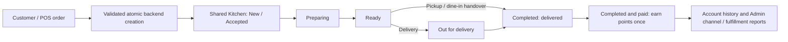

# Functional ordering interfaces — completion record

Date: 2026-10-10. Workspace: `F:\My Projects\duneandgrills`.

This phase extends the existing Phase 1 baseline and Phase 2 order engine. It does not replace them. The original baseline documents, delivery importer, kitchen preparation controller, recipe workflows, inventory/expense/attendance modules, and package configuration were preserved. Existing in-progress files were fingerprinted before editing; no reset, checkout, stash, commit, push, production write, or deployment was performed.

## Scope and reuse

| Workstream | Existing implementation reused | Additions/completion |
| --- | --- | --- |
| Customer | Home, menu/category data, customization modal, cart context/persistence, authentication, account dashboard, coupons and reward reservations | Search/price/sort filters; guest customer details and COD checkout; kitchen notes; private-code tracking; current-price reorder; resilient submission recovery; responsive failure/empty states |
| Cashier POS | Product grid/customizations, quick menu, customer search, held drafts, PIN/session controls, terminals, discount approvals, shifts/cash movements, history/repeat/void/refund, receipt printing and display transport | Delivery and phone orders; shared coupon/customer eligibility; customer account creation; customer reward selection; delivery fee; payment reference; held checkout options; durable uncertain-sale recovery; display delivery totals |
| Kitchen | Existing queue, preparation controls/timers, sound alerts and polling | Same customer/POS queue; Ready/Dispatched/recent Completed columns; guarded handover; category/station filters; server snapshots; elapsed/delay warnings; stale/reconnect feedback; SSE invalidation and polling fallback |
| Admin | Existing unified order list, catalog/category/combo/pricing/availability/settings, customer CRM, role matrix, offer editor, refund approval, reporting/exports and audit modules | Valid lifecycle controls with optimistic status checks; actual COD/manual payment collection; station assignment; coupon/reward membership controls; completed-payment reports; reward configuration audit |
| Loyalty/account | Shared User account, point ledger, reward catalog, reservation/cancellation, profile UI and admin customer controls | New-order completion-and-payment accrual; server membership tiers; coupon eligibility; reward expiry; atomic POS redemption; proportional refund adjustment; spent-points debt and repayment; server policy surfaced in profile/POS |

No UI redesign was introduced. Existing operational interfaces remain available through their original paths.

## Acceptance flow



Stored statuses remain backward compatible: `pending → confirmed → preparing → ready → delivered` for pickup/dine-in, and `ready → out-for-delivery → delivered` for delivery. The Kitchen calls the final pickup/dine-in state “Completed”; the stored value remains `delivered`. Cancellation/failure, refunds and voids retain their existing guarded workflows and audit history.

Payment is separate from fulfillment. POS records money received at sale creation. Customer COD stays pending until an authorized cashier/manager/admin records money actually received at Ready, Dispatched or Completed. Kitchen staff can hand over orders but cannot collect money. Cash collection records the actor's open drawer; with multiple open drawers, the collector must supply the terminal. Fulfillment alone never marks an order paid.

Zero-total coupon/reward checkout can be settled at zero without creating a cash-drawer movement or earning points on a zero eligible amount.

New customer/POS orders use additive `rewardAccrualPolicy: completion`. Points accrue only when both completed and paid, excluding delivery fees and discounts. Legacy orders retain their previous reward behavior. Partial refunds reverse the proportional earned entitlement; full refunds/voids restore eligible reward redemptions through the existing transactional refund engine. Refunds after points were spent create a visible points debt; later earnings/returned points settle debt before increasing spendable balance. Unique ledger source keys prevent duplicate awards/reversals.

## Routes and additive API surface

Required path-based routes remain `/`, `/menu`, `/pos`, `/pos/customer-display`, `/kitchen`, `/admin`, `/profile` and `/profile/rewards`. Existing `/kitchen/recipes`, staff, inventory and expense routes remain intact.

| API | Access / behavior |
| --- | --- |
| `GET /api/orders/config` | Public authoritative delivery minimum/fee and COD options; online provider disabled until configured |
| `POST /api/orders` | Guest or signed-in customer; existing legacy payloads and scoped idempotency preserved |
| `GET /api/orders/track/:orderNumber` | Rate limited; private tracking code supplied in a header; minimal non-PII snapshot |
| `POST /api/orders/requests/cancel` | Same actor and exact saved request; block an uncommitted request or recover the committed order/tracking code |
| `GET /api/orders/my`, `POST /api/orders/:id/repeat` | Authenticated owner; current catalog/customization/availability revalidation; unavailable lines reported |
| `PATCH /api/orders/:id/status`, `PATCH /api/orders/bulk-status` | Existing manage permission; valid transitions; expected-status checks; atomic bulk rollback |
| `PATCH /api/orders/:id/handoff` | Cashier/manager/admin/kitchen handover permission; only valid dispatch/completion transitions |
| `POST /api/orders/:id/payment` | Cashier/manager/admin; actual cash/card/manual collection; matching total; non-cash reference required; idempotent audit and points |
| `POST /api/pos/sales` | Existing authenticated/PIN session; shared engine, coupon, reward, stock, shift and payment transaction |
| `POST /api/pos/sale-requests/cancel` | Same authenticated cashier and saved request; recover receipt or safely block an unresolved attempt |
| `GET/POST /api/pos/customers`, `GET /api/pos/customers/:id/rewards` | Existing customer search; customer-only account creation; membership/catalog snapshot; active customer validation |
| `POST /api/pos/coupons/validate` | POS session; server pricing and selected customer eligibility |
| Existing POS held-sales, shifts, cash movements, history/repeat/reprint/refund/void APIs | Reused, including manager permissions, revision checks, audit and original transaction guarantees |
| `GET /api/kitchen/orders` | Authorized queue with optional source/type/search/category/station filters; financial/private tracking fields excluded |
| `PATCH /api/kitchen/orders/:id/status`, `PATCH /api/kitchen/orders/:id/handoff` | Preparation and handover are separate; expected-status and concurrent-action protection |
| `GET /api/kitchen/events` | Authorized DB change-stream invalidations only; heartbeat, periodic access/session revalidation, bounded connections; safe polling fallback |
| Existing reward reservation/account/cancellation and admin reward/offer APIs | Shared customer account; server balance/tier/expiry rules; allowlisted admin controls and configuration audits |

Online payment has a clean server extension point: public configuration exposes COD and a disabled provider slot; unsupported online payment requests return an unavailable response. Card/manual POS collection records an external transaction, not a simulated gateway charge. No gateway or fake successful online payment was added.

## Compatibility and recovery guarantees

- Legacy `source`, `orderType`, status values, identifiers and historical imports remain readable. Canonical source/fulfillment aliases and new snapshots are additive.
- Inventory, coupon usage, reward application, sale capture and held-draft consumption remain in the existing MongoDB transaction. Concurrent retries create one order and deduct stock once.
- `OrderRequestFence` adds a durable hash-only creation/cancellation fence. Cancellation races against creation inside a transaction. If creation wins, the actual order is recovered; if cancellation wins, later requests using that identifier receive 410. A timeout/409 alone never clears an uncertain request. Fences intentionally have no TTL.
- Customer uncertain submissions remain in session storage; POS uncertain payments remain in local storage, scoped by cashier and terminal. An explicit reconcile action preserves the cart/draft until the server confirms the outcome. Guest confirmation shows a private tracking code; codes are not included in navigation URLs or kitchen events.
- Membership tiers use net lifetime earned points: Bronze 0, Silver 1,000, Gold 5,000. Spending points does not downgrade membership; refund reversals can. Admin can choose minimum tiers and expiry per reward/coupon. Thresholds live in `backend/config/membership.js`.
- Accumulated points do not expire under the existing policy. Reward reservations expire after 30 minutes and cancellation/expiry returns reserved points. Catalog expiry prevents new reservations; an existing valid reservation retains its own expiry window. Eligibility and all monetary/points calculations remain server-side.
- Customer display uses the existing same-origin browser BroadcastChannel transport and a strict public bill allowlist. Delivery fee/type were added without exposing customer phone/address, tokens, internal totals or profit.
- New schema fields have compatible defaults. Existing documents need no destructive migration; legacy kitchen items derive category/station from current catalog when missing.

## Verification

All DB runs used owned temporary loopback MongoDB replica sets, never the application/staging database. All browser API requests used intercepted fixture responses against an owned local production Next server. Recipe suites were excluded from targeted selections; recipe source and workflow were not modified.

| Check | Result |
| --- | --- |
| Starting Phase 2 targeted contract/unit baseline | 20 passed |
| Backend non-recipe targeted unit tests | 75 passed |
| Existing owned integration suites plus unified order acceptance suite | 114 passed, 0 failed |
| Final order-engine + POS transaction targeted rerun | 36 passed, 0 failed |
| Legacy Auth/security, CRM, delivery import, customization, POS integration scripts | All 5 passed |
| Frontend non-recipe targeted tests | 102 passed, 0 failed |
| Customer/Kitchen/profile production browser smoke | Passed at 390px and 1440px |
| POS production browser smoke | Passed at 768px and 1440px; delivery/phone/coupon, saved-request retry and display synchronization included |
| Admin production browser smoke | Reports/CSV, existing expense regression, customer search, and live COD status/payment collection at 390px and 1440px |
| Frontend lint | `npm run lint` passed, exit 0; no errors/warnings |
| Frontend production build | `npm run build` passed, exit 0, Next.js 16.3.2; original path-based routes retained |
| Working tree whitespace and preservation | `git diff --check`; baseline docs checked against initial fingerprints; no new recipe-path changes |

Coverage includes customer creation → Kitchen preparation/handover → actual COD collection → one points award → source/fulfillment report; POS sale → same queue → completion; coupon/reward concurrency and cancellation; refunds, points debt and duplicate reversal protection; request cancellation versus in-flight creation; real authorized SSE invalidation/disconnect; wrong-role/owner validation; expired rewards; current-price reorder; drawer-specific COD collection; rolling back audit/stock failures.

Failure classification: no executed starting baseline test failure remained. Existing POS reward assertions were updated to the deliberately changed completion accrual policy while keeping an explicit legacy accrual check. Browser fixtures were corrected to match the real public catalog, server-priced held-item snapshots and new customer reward response; a quantity-save assertion now waits for its actual server response. Newly introduced query-reactivity and React ref-render lint failures were found and corrected during this phase; final checks determine the result above.

Reproducible commands (run in the corresponding backend/frontend directory):

```powershell
# Backend isolated integration coverage
node --test --test-concurrency=2 tests/posPhase2Integration.js tests/launchReadinessIntegration.js tests/recentOrdersIntegration.js tests/adminOperationsIntegration.js tests/adminReportingAccuracyIntegration.js tests/dashboardPeriodsIntegration.js tests/dashboardPerformanceIntegration.js tests/adminInventoryHealthIntegration.js tests/orderEngineIntegration.js

# Backend / frontend targeted unit selection (recipe tests excluded)
$suiteFiles = @(rg --files tests | Where-Object { $_ -match '\.test\.(js|mjs)$' -and $_ -notmatch 'recipe' })
node --test @suiteFiles

# Frontend quality gates
npm run lint
npm run build
# Browser smoke requires Playwright with the installed Chrome channel.
# Override PLAYWRIGHT_MODULE if using the bundled runtime dependency directory.
$env:ORDERING_SMOKE_URL = 'http://127.0.0.1:3018'
$env:POS_SMOKE_URL = 'http://127.0.0.1:3018/pos'
$env:REPORTING_SMOKE_URL = 'http://127.0.0.1:3018'
node tests/orderingInterfacesBrowserSmoke.mjs
node tests/posBrowserSmoke.mjs
node tests/adminReportingBrowserSmoke.mjs
```

The older standalone integration scripts must be given an explicitly owned `MONGO_TEST_URI`: several drop their test database. Do not point them at an application URI. The temporary validation runner provided only the isolated helper's loopback URI.

## Known limitations and Combined Phase B prerequisites

1. The testing URL `https://duneandgrills-testing-six.vercel.app/` was not changed or deployed to in this phase. Local production browser fixtures and real isolated API transactions passed; staging device/network validation remains before rollout.
2. Deploy additive backend models/routes with frontend changes together. MongoDB replica-set transactions and change streams, connection permissions, stable JWT secret, unique order/ledger indexes, and persistent request-fence collection are required. Back up existing data; verify defaults on representative legacy orders rather than rewriting historical accrual.
3. Validate the hosting/proxy SSE duration and cookie/session forwarding on staging. Connections are bounded and polling remains available. Confirm browser sound permission, background/reconnect behavior and kitchen tablets on the restaurant network.
4. Customer display synchronization is within the same browser origin/profile on one device. Independent-device displays need a separate authenticated transport in a later phase. Check actual receipt printer/browser print settings on site; automated checks do not print physical paper.
5. Online gateway integration needs a selected provider, external credentials, signature-verified webhooks, refund/reconciliation rules and server settlement tests. Until then COD and actual terminal/manual POS records remain the available payment paths.
6. Membership thresholds are fixed configuration; accumulated-point expiry is disabled. Approve any future policy change/migration separately so historical balances and liabilities are preserved.
7. For Combined Phase B PWA/offline work, keep financial writes online-authoritative, reuse the existing saved request identifiers/reconciliation flow, keep private tracking/payment data out of public caches, and verify install/service-worker/cache upgrades, notification permissions and cross-device acceptance against staging. Offline queued writes must not imply successful payment or completion.

## Files changed in this phase

The following list is relative to the workspace and was derived by comparing current file hashes with the starting uncommitted-file manifest. Untouched Phase 1/2 files are excluded. Existing Phase 2 files listed here were extended in place.

- `backend/config/membership.js`
- `backend/config/orderContract.js`
- `backend/config/orders.js`
- `backend/config/permissions.js`
- `backend/config/sales.js`
- `backend/controllers/kitchenEventsController.js`
- `backend/controllers/offerController.js`
- `backend/controllers/orderController.js`
- `backend/controllers/orderHandoffController.js`
- `backend/controllers/orderRequestController.js`
- `backend/controllers/posController.js`
- `backend/controllers/posCustomerController.js`
- `backend/controllers/posHeldSaleController.js`
- `backend/controllers/rewardController.js`
- `backend/models/MenuItem.js`
- `backend/models/Offer.js`
- `backend/models/Order.js`
- `backend/models/OrderRequestFence.js`
- `backend/models/PosHeldSale.js`
- `backend/models/Reward.js`
- `backend/models/User.js`
- `backend/routes/kitchenRoutes.js`
- `backend/routes/offerRoutes.js`
- `backend/routes/orderRoutes.js`
- `backend/routes/posRoutes.js`
- `backend/services/catalogService.js`
- `backend/services/couponService.js`
- `backend/services/customerOrderService.js`
- `backend/services/kitchenService.js`
- `backend/services/orderEngineService.js`
- `backend/services/orderPaymentService.js`
- `backend/services/orderRepeatService.js`
- `backend/services/posShiftService.js`
- `backend/services/refundRestorationService.js`
- `backend/services/rewardService.js`
- `backend/services/salesReportingService.js`
- `backend/tests/orderEngineIntegration.js`
- `backend/tests/posIntegration.js`
- `backend/tests/posPhase2Integration.js`
- `docs/functional-ordering-phase.md`
- `frontend/app/api/[...path]/route.js`
- `frontend/src/api/api.js`
- `frontend/src/components/CartDrawer.jsx`
- `frontend/src/components/FullMenuPage.jsx`
- `frontend/src/components/GuestOrderTracking.jsx`
- `frontend/src/components/OffersTab.jsx`
- `frontend/src/components/OrdersTab.jsx`
- `frontend/src/components/account/AccountDashboard.jsx`
- `frontend/src/components/account/DuneRewards.jsx`
- `frontend/src/components/admin/MenuItemsTab.jsx`
- `frontend/src/components/admin/OrderPaymentPanel.jsx`
- `frontend/src/components/admin/RewardsTab.jsx`
- `frontend/src/components/admin/pos/PosCustomerOptions.jsx`
- `frontend/src/components/admin/pos/PosReceiptDialog.jsx`
- `frontend/src/components/admin/pos/PosSalePanel.jsx`
- `frontend/src/components/admin/pos/PosTab.jsx`
- `frontend/src/components/kitchen/KitchenDisplay.jsx`
- `frontend/src/components/kitchen/KitchenOrderCard.jsx`
- `frontend/src/components/kitchen/kitchenConfig.js`
- `frontend/src/components/kitchen/useKitchenQueue.js`
- `frontend/src/components/pos/CustomerDisplay.jsx`
- `frontend/src/utils/adminExports.js`
- `frontend/src/utils/customerDisplaySync.js`
- `frontend/src/utils/customerOrderSubmission.js`
- `frontend/src/utils/guestTracking.js`
- `frontend/src/utils/menuFilters.js`
- `frontend/src/utils/orderLifecycle.js`
- `frontend/src/utils/orderRequestRecovery.js`
- `frontend/src/utils/posOrderSubmission.js`
- `frontend/src/utils/rewardEligibility.js`
- `frontend/tests/adminReportingBrowserSmoke.mjs`
- `frontend/tests/customerDisplay.test.mjs`
- `frontend/tests/customerInterfaces.test.js`
- `frontend/tests/orderingInterfacesBrowserSmoke.mjs`
- `frontend/tests/posBrowserSmoke.mjs`
