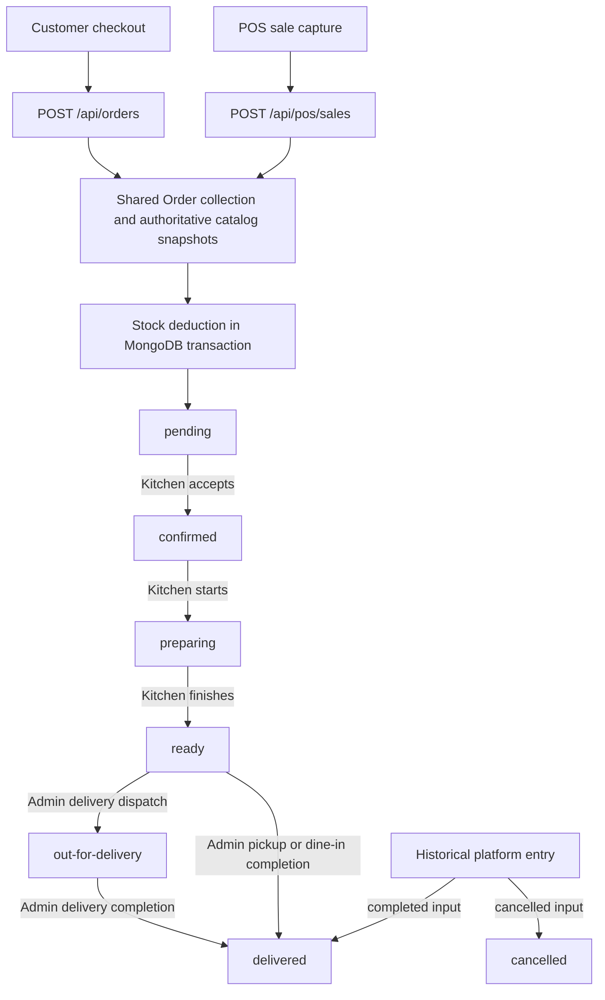

# PWA ordering baseline — Phase 1

Audit date: **2026-10-10, Asia/Riyadh**. Repository: `F:\My Projects\duneandgrills`. Testing origin: <https://duneandgrills-testing-six.vercel.app/>.

## Scope and preservation record

- Baseline branch: `main`, tracking `origin/main`; HEAD: `a4feb33` (`feat(recipes): complete manual library with safe imports and final verification`). Initial `git status --porcelain=v1 --branch` showed **no tracked or untracked changes**. This differs from the expected uncommitted work described in the request; the audit used the actual checkout without changing its Git state.
- Phase 1 is an audit only. The only repository addition is this document. No application feature, schema, API, dependency, configuration, recipe file, seed, migration or test was changed. No reset, checkout, stash, commit, push or deployment was performed.
- `frontend/AGENTS.md` was read in full. Version-matched local Next.js documentation consulted: `frontend/node_modules/next/dist/docs/01-app/02-guides/upgrading/version-16.md`, `01-app/01-getting-started/15-route-handlers.md`, `01-app/01-getting-started/17-deploying.md`, and `01-app/02-guides/progressive-web-apps.md`.
- Installed versions: Next.js **16.3.2**, React/React DOM **18.3.1**, Node.js **24.15.0**, npm **12.0.2**, local MongoDB binary **8.0**. The installed Next.js package accepts React 18.3.1 through its peer range and requires Node >=20.9.0. No dependency upgrade is proposed by this audit.
- All database integration writes used newly created, helper-owned loopback MongoDB replica sets in temporary directories, not the configured application database. Legacy tests received explicit temporary `MONGO_TEST_URI` values. No configured database contents or hosting secrets were inspected.
- Remote checks were unauthenticated HTTPS GETs only. No remote orders, logins, accounts, stock movements or settings mutations were submitted. Source findings and local test results do not prove the deployed commit matches this checkout.

## Existing architecture and reusable features

The frontend is a Next.js App Router application. Browser API calls use the shared Axios client in `frontend/src/api/api.js`, with same-origin `/api`, credentials, CSRF headers and legacy bearer migration. Inventory, finance and recipe API modules reuse that client. Next's catch-all route forwards requests to Express through server-only `BACKEND_API_URL`; server rendering uses `frontend/src/api/server.js`. Express owns authorization, validation, pricing and MongoDB writes. Mongoose is the main data layer; the MongoDB driver is also used by isolated test infrastructure.

| Area | Existing implementation and reuse points |
| --- | --- |
| Public site/catalog | Home, full menu, menu categories, dishes, published combos, availability, add-ons/customization groups, spice levels, item notes, offers/countdowns, blog, related posts, SEO metadata and sitemap. `catalogService.js` resolves authoritative catalog prices and snapshots for multiple order channels. |
| Customer ordering | Local guest cart, authenticated persistent `UserCart`, guest-to-user migration, favorites, account addresses, checkout for delivery/pickup/dine-in, server delivery fee/minimum/channel controls, coupon validation, reward item application, order confirmation and account order history. `CartDrawer.jsx`, `CartContext.jsx`, `orderController.js`. |
| Authentication | Registration restricted to `customer`; bcrypt passwords; HttpOnly JWT session cookie; readable CSRF cookie plus matching request header; legacy bearer support/migration; active-user and `sessionVersion` validation on authenticated requests. Private staff provisioning, password/PIN resets and deactivation. |
| Roles/permissions | Eight roles and backend capability matrix, independent of client navigation. POS session owner/acting cashier, PIN lock/unlock/switch and rate limits already exist. `config/permissions.js`, `middleware/auth.js`, `posSessionService.js`. |
| POS | Dedicated `/pos` workspace; terminals, quick menus, search, customization, walk-in/linked customers, dine-in/takeaway, cash/card/other payment recording, change, pickup tokens, discounts/manager approval, held-sale revision conflicts, autosave/recovery, shift cash movements, blind close/variance approval/reopen, history/reprint/repeat, transaction-safe void/refund, shortcuts and receipts. `PosWorkspace.jsx` wraps the existing `admin/pos/PosTab.jsx`; reuse these components. |
| Customer display | `/pos/customer-display?session=...` uses a per-session same-origin `BroadcastChannel` and explicit safe bill projection, with heartbeat/disconnect handling. It supports another window in the same browser context; it is not a remote display transport. |
| Kitchen | Role-restricted queue, source/type/order-number filters, four status columns, acceptance/preparation estimates, server clock offset, overdue state, ready retention, polling, focus/visibility refresh, sound/repeat alerts and atomic status conflict checks. Kitchen projections omit phone/address/prices/payment data while retaining name and preparation instructions. |
| Admin | Dashboard periods/comparisons in Riyadh time, reporting definitions, needs-attention and POS shift overview, recent orders, full order details, URL filter state, single/bulk status updates, refunds, CRM/notes, catalog/combos/categories, offers/rewards/blog/reviews, staff, settings, analytics, audit and record search. Freshness/error/offline feedback already exists. |
| Delivery platform entry | Manual historical Jahez/Keeta/HungerStation/Ninja entry; provider-scoped duplicate prevention, original occurrence date, system/platform total comparison, completed/cancelled entry and inventory/reporting linkage. These are historical records, not live aggregator integrations. |
| Inventory/purchasing | Stock items/SKUs/categories, purchase-unit conversions/brands, batches/expiry/quality eligibility, ingredient and add-on stock recipes, immutable movement snapshots, sale deductions/restoration, waste, counts/conflict review, purchase orders/receipts, supplier invoices/payments, price history, reorder suggestions/action center and reporting. Critical operations require replica-set transactions. |
| Finance/staff | Expenses/categories/recurring generation, idempotent financial submissions, exports/reporting; attendance PIN clock, shifts, leave, corrections and monthly reporting. Manager finance access is read-only. |
| Existing recipe work | Private kitchen instruction/manual, draft/revision/trial/approval workflow and print views under `/kitchen/recipes`; separate from ingredient-consumption recipes under `/inventory/recipes`. Existing recipe implementation and data were preserved. No recipe-specific suite, import or migration was run. |

### Database model map

There are **49 model files** under `backend/models`. The model families already cover the system; later phases should extend their contracts rather than create parallel order/user/catalog models.

| Domain | Models |
| --- | --- |
| Identity/customer | `User`, `UserCart`, `CustomerNote` |
| Catalog/content/promotions | `MenuItem`, `MenuAddOn`, `Combo`, `ContentCategory`, `BlogPost`, `Review`, `Offer`, `Reward` |
| Orders/control | `Order`, `Refund`, `Counter`, `AuditLog`, `RateLimitBucket`, `RestaurantSettings` |
| POS | `PosTerminal`, `PosSession`, `PosShift`, `PosHeldSale`, `PosQuickItem`, `PosDiscountApproval`, `CashMovement` |
| Stock | `InventoryItem`, `InventoryCategory`, `InventorySettings`, `InventoryBatch`, `InventoryRecipe`, `AddOnInventoryRecipe`, `StockTransaction`, `InventoryCount` |
| Purchasing/payables | `Supplier`, `PurchaseOrder`, `PurchasePriceHistory`, `SupplierInvoice`, `SupplierPayment`, `ReorderSuggestion`, `PurchasingAction`, `PurchaseAutomationRun` |
| Expenses | `Expense`, `ExpenseCategory`, `RecurringExpense` |
| Attendance | `Attendance`, `Shift`, `LeaveRequest` |
| Private culinary instructions | `RecipeInstruction`, `RecipeInstructionRevision`, `RecipeInstructionTrial` |

Important existing contracts:

- `Order` stores authoritative item/add-on/combo snapshots, fulfillment status/history/timestamps, separate payment and inventory statuses, source/user/cashier/terminal/shift links, discounts/coupon/redemption snapshots, refund totals in halala, and historical platform metadata. Order numbers are immutable/unique; POS idempotency keys and platform/provider IDs have unique indexes. New order numbers use `DG-YYYYMMDD-NNNN` with an atomic Riyadh-day counter; old identifiers must remain readable.
- `User` stores role, active/session state, password/PIN hashes, addresses, favorites, saved posts, card **metadata**, reward balance/redemptions and point transactions. Card metadata is not payment tokenization or charging capability.
- `Refund` has its own `requested/approved/rejected/processing/completed/failed/cancelled` lifecycle, idempotency/reservation amounts and optional item restoration. Refund completion updates payment status and financial ledgers; it does not automatically rewrite fulfillment status to `refunded`.
- `InventoryRecipe`/`AddOnInventoryRecipe` describe stock consumption. Culinary instruction revisions are a different domain, intentionally not a replacement or duplicate of those stock models.
- `RestaurantSettings` is the existing singleton for Riyadh opening hours, order channels/fees/minimum, preparation, polling/sound, POS checkout/shifts/devices, procurement, receipts and location. `RateLimitBucket` supplies shared production throttling with TTL expiry; `PosSession` also has TTL expiry.
- Schema/index declarations were inspected, but production index installation, historical data quality, volume and reconciliation were not audited against a live database.

## Routes and access map

Routing remains **path-based**. No host/subdomain routing was found or introduced. Existing admin tabs and filters use query parameters within `/admin`; this is separate from the top-level path structure.

| Frontend route | Purpose / current access |
| --- | --- |
| `/`, `/menu`, `/blog`, `/blog/[slug]` | Public site, catalog and content |
| `/login` | Public authentication UI |
| `/profile` and `/profile/{orders,favorites,rewards,addresses,payment-methods,reviews,settings}` | Authenticated account; section pages validate paths, shared layout renders account content |
| `/pos` | Admin, manager, cashier; terminal/session workspace |
| `/pos/customer-display` | Public shell; bill only through matching local display channel |
| `/kitchen`, `/kitchen/recipes` | Admin, manager, kitchen |
| `/admin?tab=...` | Admin/manager; overview, orders, menu, combos, categories, customers, offers, rewards, blog, reviews, analytics, audit, staff, settings |
| `/admin/quick-delivery` | Admin, manager, cashier; historical platform entry |
| `/admin/record-search` | Staff role gate; backend returns only capability-authorized record types |
| `/admin/staff`, `/admin/staff/{attendance,shifts,leave}` | Admin/manager; management/corrections further restricted by backend capabilities |
| `/admin/expenses`, `/admin/expenses/{entries,recurring,categories,reports}` | Admin, manager, accountant; manager read-only |
| `/inventory`, `/inventory/[section]` | Admin, manager, inventory, storekeeper; section list below |
| `/staff-clock` | PIN-based staff clock UI; separate from administrative authentication |
| `/tips-and-tricks` | Existing staff knowledge base with role-filtered content |
| `/api/[...path]` | Next BFF proxy to Express; dynamic, no-store |
| `/robots.txt`, `/sitemap.xml` | Metadata routes; production domain currently hard-coded |

Inventory sections: `stock-items`, `batches`, `categories`, `suppliers`, `purchase-orders`, `supplier-invoices`, `purchase-prices`, `reorder-suggestions`, `purchasing-actions`, `stock-in`, `stock-out`, `stock-movements`, `recipes`, `waste-damaged`, `inventory-count`, `expiry-tracking`, `low-stock-alerts`, `reports`, `settings`.

Role summary from `backend/config/permissions.js`:

| Role | Backend capability boundary |
| --- | --- |
| admin | All capabilities |
| manager | Dashboard/orders/catalog/settings/kitchen/POS, shift/terminal/history/void/refund, inventory/purchasing/payables, finance read, staff/attendance read, audit/reviews; no general staff/attendance management or finance write |
| cashier | POS operation, all-orders read, refund read/request; no general fulfillment management, POS void/refund approval, catalog or settings writes |
| kitchen | Kitchen operation only |
| inventory / storekeeper | Inventory read/write, reorder read/manage, purchasing-action read; no purchase/count/payables approval |
| accountant | Finance read/write, refund read/process, inventory/payables read, payables write/payment recording, purchasing-action read |
| customer | Own account/cart/orders/rewards; no staff capability |

`ProtectedRoute` is a client-side UX guard. API capabilities and ownership checks are the actual data boundary. An anonymous HTML 200 for a protected route does not mean its private API data is public.

### Express API map

Every prefix below is mounted in `backend/server.js` and reachable through the frontend `/api` proxy. `:id` denotes existing MongoDB identifiers. Methods/access are summarized from `backend/routes/*Routes.js`; domain controllers add ownership, validation and transaction checks.

| Prefix | Existing endpoints / methods | Access |
| --- | --- | --- |
| `/api/auth` | POST `register`, `login`, `logout`, `migrate-session`; GET `me`; PUT/PATCH `me` | Register/login/logout public; migration/me authenticated; login/register throttled |
| `/api/menu` | GET root/`:id`; GET `manage`; GET/POST `manage/add-ons`; PUT/DELETE `manage/add-ons/:addOnId`; POST root, PUT/DELETE `:id` | Public reads; management requires `catalog.manage` |
| `/api/combos` | GET root/`:idOrSlug`/`manage`; POST root; PUT/PATCH/DELETE `:id` | Public published reads; management requires catalog capability |
| `/api/categories` | GET root/`manage`; POST root; PATCH/DELETE `:id` | Public read; catalog management |
| `/api/blog` | GET root/`categories`/`slug/:slug`/`slug/:slug/related`/`manage`/`:id`; POST root, PUT/DELETE `:id` | Published reads public; managed/id reads and writes require catalog capability |
| `/api/offers` | GET root/`:id`/`manage`; POST `validate-coupon`/root; PUT/PATCH/DELETE `:id` | Public offers/coupon validation; catalog management |
| `/api/rewards` | GET root/`:id`/`manage`/`me`; POST root/`:id/redeem`; PATCH/DELETE `:id`; DELETE `redemptions/:redemptionId` | Public catalog; own reward account/redemption authenticated; catalog management |
| `/api/orders` | POST root; GET root/`config`/`my`/`stats`/`:id`/`track/:orderNumber`; PATCH `:id/status`/`bulk-status` | Creation optional auth; config public; tracking secret + throttle; own reads authenticated; all-order/stat reads and management capability-gated |
| `/api/orders` refunds | GET `refunds`/`:id/refunds`; POST `:id/refunds`; POST `refunds/:refundId/{approve,reject,process,complete,fail,cancel}` | Separate refund read/request/approve/process capabilities |
| `/api/kitchen` | GET `orders`; PATCH `orders/:id/status`; GET `recipes`/`recipes/:code`/history/trials; POST trials/workflow action; PUT recipe; GET manual/inventory-options | Kitchen capability throughout; instruction management/manual/options further restricted to admin/manager |
| `/api/pos` | GET/POST `sales`; GET `sales/:id`; POST sale reprint/repeat/void/refunds; POST `refunds/:refundId/{approve,complete,reject,cancel}` | POS capability/session; ownership/history scope; extra void/refund capabilities |
| `/api/pos` session/catalog | GET `customers`, `session`, `session/cashiers`, `terminals`, `quick-menu`; POST session lock/unlock/switch and terminals; PUT `session/pins/:id`, `quick-menu`; PATCH `terminals/:id` | POS operation, PIN throttles; staff/terminal/quick-menu management capability gates |
| `/api/pos` held/shift | GET/POST `held-sales`; GET/PATCH/DELETE `held-sales/:id`; POST `discount-approvals`; GET `shift-config`, `shifts/current`, `shifts`, `shifts/:shiftId`; POST open/cash-movements/close/reopen | POS; cashier/terminal/revision checks, shift-manager restrictions where applicable |
| `/api/delivery-orders` | GET `config`, `duplicate-check`; POST `orders` | POS capability; provider/channel validation |
| `/api/admin` | GET dashboard/operations-overview/analytics/users/search/customers, customer detail/orders/favourites/rewards; GET/POST customer notes, PATCH/DELETE note; GET audit-logs | Admin dashboard capability, audit additionally requires audit read |
| `/api/admin` staff | GET/POST `staff`; PATCH `staff/:id`; POST active/reset-password/reset-pin | Staff read/manage capabilities, before dashboard gate |
| `/api/profile` | GET dashboard/stats/favorites/saved-posts/addresses/payment-methods; favorite/favorite-combo/saved-post POST/DELETE; address/payment-method POST/PATCH/DELETE/default PATCH | Authenticated own user |
| `/api/cart` | GET/POST/DELETE root; POST migrate; PATCH/DELETE `:productId` | Authenticated own cart |
| `/api/reviews` | POST root; GET me/manage; DELETE `:id` | Own authenticated reviews; moderation capability; delivered-order eligibility |
| `/api/settings` | GET public/root; PUT root | Public safe settings subset; full read/write requires settings management |
| `/api/inventory` master/stock | Dashboard/alerts/reports/settings, items/history, categories/SKU suggestion, suppliers/purchases, batches, movements, recipes/add-on-recipes, waste, counts and submit/complete/review/cancel actions | Inventory read globally; write/count approval gates per action |
| `/api/inventory` purchasing | Purchase-order list/create/detail/update/status/receive; purchase-price-history; reorder-suggestion list/recalculate/review/dismiss/generate-drafts; purchasing-action list/refresh/state | Inventory read plus write/purchase approval/reorder/automation/action capabilities |
| `/api/inventory` payables | Supplier-invoice list/create/detail/update/status/billable-quantities/payments; supplier-payment reversal | Inventory read plus payables read/write/approval/payment capabilities |
| `/api/expenses` | GET dashboard/reports/entries/export/entries/detail/categories/recurring; POST entries/categories/recurring/generate and archive/cancel actions; PATCH entries/categories/recurring | Finance read globally; finance write for mutations |
| `/api/attendance` | POST clock identify/in/out; GET records/detail/reports/monthly/shifts/leave; PATCH records/shifts/leave; POST shifts/archive/leave | Clock PIN + rate limits; administrative reads/manage capabilities |
| `/api/record-search` | GET root/`:type/:id` | Authenticated, rate-limited, capability-aware types/detail |
| `/api/health`, `/api/readiness` | GET | Public health/readiness; readiness checks transaction capability |

Proxy compatibility: cookies, authorization, origin, content-type, CSRF, POS session and order tracking headers are forwarded; multiple `Set-Cookie` values are returned. API responses are no-store. Preserve current `{ success, data, count, ... }` envelopes and domain-specific projections rather than imposing a new response shape globally.

## Current order flow and status lifecycle



The diagram describes the normal operational path, **not a globally enforced state machine**. Detailed current behavior:

1. **Website:** checkout UI requires login even though `POST /api/orders` supports guests. Backend resolves current prices/customizations, minimum/fee, coupon and optional reward item; reserves an order number and tracking secret; writes the order and deducts stock transactionally. New status defaults to `pending`, payment to `unrecorded`/`pending`. It returns `201`, a customer-safe order and tracking token. Website creation has no idempotency-key handling.
2. **POS:** cashier submits an idempotency key, terminal/shift/held-sale revision, items and payment details. Transaction captures the sale record, stock deduction and applicable cash movement/held-sale consumption. The new fulfillment status is **pending** while payment is **paid**. Linked-customer points are attempted after the committed sale through a separate guarded transaction; failure returns a warning without undoing the sale. “Sale completed” here means checkout capture, not kitchen completion.
3. **Kitchen queue:** polls `GET /api/kitchen/orders`, sharing the same collection rather than receiving a separate copied ticket. Excludes `manualEntry:true`; includes pending/confirmed/preparing and recently ready orders. Default ready retention is 30 minutes, configurable. Queue expiry hides the card; it does **not** complete the order.
4. **Kitchen transitions:** only `pending → confirmed → preparing → ready`. PATCH uses a compare-and-set on the expected source status; repeats/skips/conflicting writes return 409. It records acceptance/start/ready timestamps, history and audit, and sets the preparation deadline on acceptance (or missing deadline on start). Kitchen users cannot dispatch or complete.
5. **Ready → completion:** admin/manager uses `/api/orders/:id/status` or bulk status. Normal delivery uses `out-for-delivery → delivered`; pickup/dine-in/takeaway can use `delivered` as the existing terminal value. There is **no `completed` Order status** and no dedicated pickup handoff/delivery rider endpoint. Keep existing stored statuses backward-compatible if display terminology changes later.
6. **Historical platform entry:** `entryStatus:completed` maps directly to `status:delivered`, `paymentStatus:paid`; cancelled entry maps to `cancelled`/`voided`. It records aggregator-prepaid amounts, creates no customer reward earnings and is excluded from kitchen. It is not the Customer/POS live preparation path.
7. **Cancellation/failure:** requires a reason for cancellation; generic admin cancellation/failure of captured POS payments is rejected in favor of POS history void/refund workflows. Generic pre-preparation cancellation/failure can restore deducted stock; prepared food is not automatically restocked. Reward reversals/redemption restoration are separate side effects.
8. **Refunds:** use the existing refund workflow. Directly setting fulfillment status to `refunded` is rejected by generic status mutation. Completed refunds change `paymentStatus` to `partially_refunded`/`refunded`, reserve/reconcile halala amounts, and optionally restore selected stock with permission/quantity checks. Fulfillment can remain `delivered`.

Separate lifecycle fields:

| Field | Existing values / meaning |
| --- | --- |
| `Order.status` | `pending`, `confirmed`, `preparing`, `ready`, `out-for-delivery`, `delivered`, `cancelled`, `refunded`, `failed` |
| `Order.paymentStatus` | `unpaid`, `pending`, `paid`, `partially_refunded`, `refunded`, `voided`, `failed` |
| `Order.inventoryStatus` | `pending`, `deducted`, `restored`, `not_required` |
| Reward redemption | `reserved`, `applied`, `cancelled`, `expired`, `restored`; reservation normally 30 minutes |
| Reward earnings | 10 points per eligible SAR; website earns on delivered, POS on paid sale capture; guards prevent repeat award, refund/void reversal has its own path |

## Incomplete and inconsistent behavior

These are source findings, not failures observed in the passing baseline tests.

| ID / priority | Finding and consequence | Evidence / existing implementation to extend |
| --- | --- | --- |
| FLOW-01 / high | Admin status updates validate destination membership but do not enforce source-to-destination transitions, terminal-state locks or kitchen-style compare-and-set. Skips/reversals/repeated history entries and races with kitchen remain possible. Moving a cancelled/restored order back into a live state does not re-deduct stock in this function. | `orderController.js:applyOrderStatusUpdate`, `bulkUpdateOrderStatus`; compare `kitchenService.js:transitionKitchenOrder`. |
| FLOW-02 / high | Bulk admin updates run sequentially without one group transaction or per-order result envelope. A later error can leave earlier orders changed while the caller receives an error. Status/reward/audit effects are also not one common transaction; a failure after a write may leave a changed order despite an error. | Same controller; stock restoration alone uses `runInventoryTransaction`; kitchen writes status before audit. |
| FLOW-03 / medium | Admin confirmation without an explicit changed preparation estimate does not create the deadline that kitchen confirmation creates. Admin overdue projection includes pending/out-for-delivery, while kitchen overdue logic only uses confirmed/preparing. | `orderController.js`, `orderSerializer.js:ACTIVE_PREPARATION_STATUSES`, `kitchenService.js`. |
| ORDER-01 / high | Customer submit has only UI submitting state; no server idempotency. A lost successful response/retry can create two orders and stock deductions. POS has server idempotency and should be reused as a design reference. | `CartDrawer.jsx:handleCheckout`, `api.js:placeOrder`, `orderController.js:createOrder`, `posController.js:createPosSale`. |
| ORDER-02 / medium | Guest creation/secret tracking API exists, but customer checkout prompts login, tracking token is not used by a frontend tracking route, and there is no `/track` page or corresponding API client flow. | `CartDrawer.jsx:handleProceed`, `api.js:placeOrder`, `orderRoutes.js`, `trackGuestOrder`. |
| POS-01 / medium | POS request key is held in a React ref; held drafts persist separately. Same mounted attempt can retry, but preserving/reconciling an unknown checkout outcome across reload needs explicit verification. | `PosTab.jsx:requestKey`, `complete`, recovery logic; `persistedSubmission.js` already provides a reusable pattern for financial submissions. |
| PAY-01 / medium | Website orders remain unrecorded/pending; checkout does not charge saved cards, integrate a gateway or provide a general website payment-capture ledger. Generic delivered transition marks POS paid, not website paid. Paid POS records and aggregator-prepaid records have distinct reporting definitions. | `Order.js`, `User.js`, `orderController.js`, `salesReportingService.js`; do not equate fulfillment completion with collected revenue. |
| PWA-01 / planned gap | No app manifest, service worker registration, install prompt, offline shell/cache policy, Web Push subscription or background order synchronization was found. Responsive UI, local carts, held-sale recovery and admin offline indicators already exist; they are not a complete PWA. | `frontend/app`, `public`, `layout.jsx`, `refreshController.js`; remote manifest 404. |
| CHANNEL-01 / planned gap | Sources/settings include phone and aggregators, but public creation always uses website, POS uses pos, and delivery entry is historical. No dedicated live phone order creation, aggregator webhook/API ingestion, rider tracking or remote customer display transport found. | `config/sales.js`, `orders.js`, `deliveryOrderService.js`, `customerDisplaySync.js`. |
| ROLE-01 / medium | Accountant has backend inventory/payables capabilities but `/inventory` client layout excludes accountant. Thus payables UI access differs from API permissions. Cashier all-orders API read likewise exceeds available general orders UI, intentionally or otherwise. | `config/permissions.js`, `app/inventory/layout.jsx`, `AdminShell.jsx`, `orderRoutes.js`. |
| AUTH-01 / planned gap | No public password recovery/email verification/MFA flow in auth routes. Logout clears browser cookies but does not itself invalidate already issued bearer credentials; staff deactivation/reset uses session-version controls. | `authRoutes.js`, `authController.js`, `middleware/auth.js`. |

Additional duplication/maintenance observations:

- Status lists/labels/styles exist separately in backend config, `Order` schema, admin order utilities/UI, account badges and kitchen config. Order types/sources also have UI-local lists. Preserve serialized values and centralize only within a separately scoped later change.
- Polling has three implementations: customer `setInterval`, kitchen custom queue hook and admin `refreshController`/`useFreshResource`. They differ in visibility, failure/backoff and stale-state presentation. Reuse existing utilities rather than add a fourth polling framework.
- Content invalidation runs in both the successful API proxy and client-triggered `refreshContentCache` server action. Comments explain Router Cache refresh intent, so this is deliberate overlap; its costs/authorization need review before extension.
- Old commented order-creation/numbering examples and old commented menu route definitions remain. They are not active duplicate endpoints and were not cleaned up in this phase.
- Offers and rewards are intentionally separate: coupons support order/product/category scope, fixed/percentage discount, dates/minimum/limits and usage reservation; rewards spend/return points with a ledger and reserved free menu item. Website coupon/reward reservation steps occur outside the order/stock transaction with compensating cleanup; process interruption consistency needs a later targeted test.

## Security and deployment gaps

Existing protections should be retained: backend capability/ownership checks, customer-only registration, bcrypt, session-version validation, secure production HttpOnly cookies, cookie CSRF checks, exact origin allowlist, shared production rate limits, private projections, secret-hash guest tracking, audit records, immutable identifiers and fail-closed inventory/purchasing transactions.

| ID | Observed gap or verification limit | Required later action |
| --- | --- | --- |
| SEC-01 | No route rate limit on public order creation or coupon validation. Login/register, guest tracking, staff clock, record search and sensitive POS operations already have limits. | Define order/coupon abuse budgets and test through the real proxy; preserve legitimate retry behavior. |
| SEC-02 | Next API proxy copies content-type/Set-Cookie/cache policy but drops Express security headers, request ID and RateLimit headers. Testing API responses lacked `X-Frame-Options` and `X-Request-Id`; HTML lacked CSP/frame restriction. HSTS was present. | Review safe header forwarding and frontend security headers; test with real hosting responses. Do not describe Express-only headers as site-wide protection. |
| SEC-03 | `trust proxy:1` and forwarded IP handling depend on the actual hosting chain. The Next proxy copies incoming `x-forwarded-for`; effective trusted client identity was not verified. | Confirm trusted-hop/IP behavior before relying on rate-limit identity. This is a configuration risk, not a demonstrated bypass. |
| SEC-04 | `refreshContentCache` server action has no explicit authentication/capability check; it only invalidates a fixed path allowlist. | Assess unnecessary public revalidation/cost exposure; it is not a direct database-write endpoint. |
| DEP-01 | No tracked Vercel project config, CI workflow, container/deployment manifest, root build orchestration or explicit production Node engine pin found. Backend exports an app for `VERCEL`; deployed backend root/provider settings are not in the checkout. | Record frontend/backend roots, build/start commands, runtime, preview-vs-production environment mapping and deployed revision in the operations record. |
| DEP-02 | Frontend requires `BACKEND_API_URL` including `/api`. SSR additionally accepts legacy `NEXT_PUBLIC_API_URL`, whereas the proxy does not. Without config both fall back to localhost. Proxy has no explicit upstream timeout; SSR helper has 5 seconds. | Verify one server-only API target for each environment and define timeout/error behavior. Preserve the legacy SSR fallback until a planned compatibility change. |
| DEP-03 | Backend example is a development standalone DB with `ALLOW_NON_TRANSACTIONAL_INVENTORY=true`; startup does not comprehensively validate JWT strength, HTTPS origins or all required environment fields. | Verify `NODE_ENV=production`, strong `JWT_SECRET`, replica set, fallback disabled, exact frontend origins, HTTPS/SameSite cookies. Do not reuse `.env.example` unchanged for production. |
| DEP-04 | Mongo connection middleware runs before health/readiness, so health depends on DB connection rather than being a separate process liveness check. Non-Vercel production startup refuses missing transaction capability; Vercel branch relies on readiness/operation checks instead. | Define deployment readiness gating and outages/timeouts explicitly; confirm provider traffic/monitoring behavior. |
| DEP-05 | Production domain/canonical/sitemap/robots and Google font fetching are fixed in source; `next.config.mjs` permits optimized remote images only from Unsplash. | Validate preview indexing policy, canonical domain, actual catalog image hosts and build network assumptions. Existing `SmartImage` fallback should be considered before image changes. |
| DEP-06 | Backup/restore and rollback runbook exists, but provider secrets, backups, restore drill, monitoring, alert ownership, index rollout, provider settlement and production load were not available for verification. | Supply operational evidence and staging rehearsal before release; readiness 200 alone does not establish these. |

No production security fix was attempted in Phase 1.

### Testing-origin read-only observations

Direct HTTPS GET checks on the audit date (fallback after the web retrieval tool could not access the site):

| Request | Observed response |
| --- | --- |
| `/`, `/pos`, `/kitchen`, `/admin` | 200 HTML; expected titles; protected pages use client guards |
| `/api/health` | 200 JSON, `success:true` |
| `/api/readiness` | 200 JSON, `success:true`, `database:connected`, `transaction.ready:true` |
| `/api/orders/config` | 200 JSON, `success:true` |
| `/api/auth/me`, `/api/orders`, `/api/kitchen/orders`, `/api/admin/dashboard`, `/api/pos/sales`, `/api/rewards/me` | 401 without credentials |
| `/api/orders/track/BASELINE-NONEXISTENT` without token | 404; no order data |
| `/manifest.webmanifest` | 404 |

API responses above had no-store cache policy. No authenticated browser/order lifecycle was exercised on the remote deployment. Live checks did not inspect customer records or retrieve hosting configuration.

## Baseline checks and failure separation

All executed checks passed without source changes. **258 Node test cases passed** (including nested integration subtests), plus **four legacy integration scripts** passed. The legacy scripts use assertions without Node test-case counts, so they are not included in 258. This is a targeted baseline, not a claim that every repository test or browser suite ran.

| Check | Exact selection / result |
| --- | --- |
| Frontend tests | All top-level `tests/*.test.js` and `tests/*.test.mjs` excluding filenames containing `recipe`: **24 files, 92 pass, 0 fail, 0 skipped**, exit 0 |
| Backend unit tests | All top-level `tests/*.test.js` excluding filenames containing `recipe`: **15 files, 71 pass, 0 fail, 0 skipped**, exit 0; kitchen transitions/projection, settings, security, delivery validation, attendance, inventory, dates/reporting and purchasing safety included |
| Backend owned-replica integration | `posPhase2Integration.js`, `launchReadinessIntegration.js`, `recentOrdersIntegration.js`, `adminOperationsIntegration.js`, `adminReportingAccuracyIntegration.js`, `dashboardPeriodsIntegration.js`, `dashboardPerformanceIntegration.js`, `adminInventoryHealthIntegration.js`: **95 pass, 0 fail, 0 skipped**, exit 0 |
| Legacy targeted integration | `authSecurityIntegration.js`, `customerCrmIntegration.js`, `deliveryOrderIntegration.js`, `menuCustomizationIntegration.js`, each under explicit newly owned local test DB URI: **4/4 scripts pass**, exit 0 |
| Frontend lint | `npm run lint` → `eslint .`: exit 0, no lint diagnostics; no autofix |
| Frontend production build | `npm run build` → Next.js 16.3.2 Turbopack: exit 0; compilation 106s, 24 static pages generated; existing dynamic and path routes listed successfully; no warning/error reported |
| Backend build/lint | No backend build or lint script exists in `backend/package.json`; Express is started directly with Node. This is missing check configuration, not a successful backend lint/build claim. |

Failure categories:

- **Existing automated test/lint/build failures:** none in the selections above.
- **Existing functional/security/deployment gaps:** FLOW/ORDER/PWA/SEC/DEP findings above; passing tests do not cover all of them.
- **Environmental/tool limitation:** web retrieval could not fetch the testing site; direct Node HTTPS GETs succeeded. This was not an application outage.
- **Not run:** recipe-specific tests/imports/migrations, every older inventory/purchasing/expense regression runner, standalone browser smoke scripts, provider configuration audit, production data reconciliation/load tests and authenticated remote end-to-end flow. `launchReadinessIntegration.js` contains an optional Playwright rehearsal gated by `PHASE4_PLAYWRIGHT_MODULE`; this run did not enable it. Node's zero-skipped count does not imply that conditional browser branch executed.

Logs are outside the repository in `%TEMP%\dg-phase1-baseline-20261010\`: `frontend-tests.log`, `backend-unit-tests.log`, `backend-integration-tests.log`, `backend-legacy-targeted.log`, `frontend-lint.log`, `frontend-build.log`. They are local, temporary evidence, not deployment artifacts or committed files.

Reproduce unit selection in PowerShell, from the indicated package directory:

```powershell
# frontend
$testFiles = @(Get-ChildItem tests -File | Where-Object {
  $_.Name -match '\.test\.(js|mjs)$' -and $_.Name -notmatch '(?i)recipe'
} | ForEach-Object { $_.FullName })
node --test @testFiles
npm run lint
npm run build

# backend
$testFiles = @(Get-ChildItem tests -File | Where-Object {
  $_.Name -like '*.test.js' -and $_.Name -notmatch '(?i)recipe'
} | ForEach-Object { $_.FullName })
node --test @testFiles
node --test tests/posPhase2Integration.js tests/launchReadinessIntegration.js tests/recentOrdersIntegration.js tests/adminOperationsIntegration.js tests/adminReportingAccuracyIntegration.js tests/dashboardPeriodsIntegration.js tests/dashboardPerformanceIntegration.js tests/adminInventoryHealthIntegration.js
```

The integration selections above own their temporary replica sets. For legacy scripts, do **not** run their database-resetting commands against the application URI. The audit used the existing `withIsolatedMongo` helper with this inline Node orchestration from `backend`:

```javascript
// node --input-type=module -e '<this module>'
import { withIsolatedMongo } from './tests/helpers/isolatedMongo.js';
import { spawn } from 'node:child_process';
const suites = ['authSecurityIntegration', 'customerCrmIntegration',
  'deliveryOrderIntegration', 'menuCustomizationIntegration'];
await withIsolatedMongo(async ({ uri }) => {
  for (const name of suites) {
    const code = await new Promise((resolve, reject) => {
      const child = spawn(process.execPath, ['tests/' + name + '.js'], {
        windowsHide: true, stdio: 'inherit', env: { ...process.env,
          MONGO_TEST_URI: uri.replace('/dg_record_id_test?',
            '/dg_phase1_' + name.toLowerCase() + '_test?'),
          NODE_ENV: 'test', JWT_SECRET: 'phase1-isolated-audit-only-secret',
          ALLOW_NON_TRANSACTIONAL_INVENTORY: 'false' },
      });
      child.on('error', reject); child.on('exit', resolve);
    });
    console.log('SUITE ' + name + ' EXIT ' + code);
    if (code !== 0) process.exitCode = 1;
  }
});
```

## Acceptance criteria for later phases

These are proposed gates for later scoped work; they do not authorize implementation in Phase 1 or prescribe an unrequested phase sequence.

| Workstream | Acceptance criteria |
| --- | --- |
| Shared lifecycle | Define source/status/role transition matrix including cancellation, refund, reactivation and pickup/dine-in completion. Preserve existing status strings and historical orders. Admin and kitchen enforce the approved matrix and stale-write conflicts; concurrent attempts cannot double-restore stock or duplicate effects. Bulk failure behavior is explicit and tested. Acceptance/start/deadline/ready/history projections agree. |
| Customer ordering/retry | Resolve whether guest checkout is intended; extend existing cart/checkout and optional-auth order API accordingly. Server-authoritative totals/customizations/coupons/rewards remain intact. One logical submission retried after lost response/reload produces one order/deduction; request ownership and changed payload conflicts are tested. Secret tracking never exposes PII; token storage/access/recovery rules are explicit. |
| POS/kitchen handoff | Existing paid POS creates exactly one pending order; it appears in kitchen, advances with conflict checks, and completion does not re-capture payment/re-award points. Test with two staff sessions, a lost response and a reopened browser. Ready retention must not silently complete/hide an unacknowledged operational handoff without agreed behavior. Reuse existing terminals, shifts, held sales and PIN sessions. |
| PWA/install/offline | Follow installed Next.js local PWA docs. Valid manifest/icons/start URL/scope work with path routes; agreed Android/iOS install flows are verified. Service-worker cache/update/logout rules exclude private API/PII/session/payment data. Offline UI distinguishes retained data from live data; order/payment writes are disabled or use an explicitly approved durable idempotent reconciliation design. Do not infer offline ordering permission from local cart persistence. |
| Notifications/freshness | Reuse current polling/alerts and settings; specify which channels need Web Push/SSE if any. Permissions, browser sound restrictions, hidden/reopened state, reconnect, deduplication and stale timing are verified. Cross-device displays require an explicit separate transport decision. |
| Offers/rewards/payments | Preserve promotion scope/date/minimum/usage and reward ledger/redemption contracts. Race/interruption/retry tests prove no duplicate coupon reservation, points spend/earn/reversal or free-item deduction. Decide whether payment scope remains manual recording or includes a gateway; provider charging/webhooks/refunds require their own scoped idempotency/reconciliation gates. |
| Authorization/security | Verify every staff role and customer ownership through the proxy, including accountant/payables UI alignment, locked/switched/disabled/expired sessions, CSRF and guest-token privacy. Verify rate-limit identity/headers, public endpoint budgets, safe security headers and revalidation boundary without breaking bearer compatibility. |
| Deployment/release | Record deployed revision, roots, Node version, API target, exact origins/cookie mode and preview separation. Readiness passes with transactions; no standalone production fallback. Tests/lint/build plus authenticated staging browser rehearsal pass; backup/restore, monitoring/rollback and index rollout evidence exists. Existing recipe functionality remains untouched and passes its owner-approved regression gate. |

### Next-phase prerequisites

1. Choose the next phase's exact scope from these gaps; keep recipe work excluded unless separately authorized. Confirm whether the now-clean checkout is the intended baseline if further local work exists elsewhere.
2. Agree guest-vs-login checkout, completion display terminology using existing `delivered`, and who performs ready-order handoff/dispatch. Decide payment-provider and offline-write scope before adding UI or statuses.
3. Prioritize FLOW-01/FLOW-02 and ORDER-01 before promising safe lifecycle/retry/offline behavior; obtain acceptance for exception transitions and partial bulk outcomes.
4. Confirm staging backend/root/env/deployed revision, isolated test data and authorized staff test accounts for a real browser Customer/POS → Kitchen → Ready → Delivered rehearsal. Provide operational backup/monitoring evidence before any release.
5. Retain the current passing targeted commands as regression gates; add tests only for the behavior selected in the next phase. Add backend lint/CI orchestration in a separately scoped maintenance phase if desired.

Phase 1 delivery: this audit document, reusable implementation map, lifecycle map, measured passing baseline, prioritized gaps and later acceptance gates. **No new feature implemented.**
