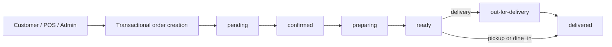

# Phase 2 — Unified order engine

Verified locally on 2026-10-10. This phase extends the existing Order, POS, historical delivery, stock, coupon, reward and refund implementations. It introduces no UI redesign, recipe changes, data migration, commit, push or deployment. `/pos`, `/kitchen`, `/admin` and the existing customer routes remain path based.

## Starting state and reuse

At the start of Phase 2, `git status` showed only the untracked Phase 1 report, `docs/pwa-ordering-baseline.md`. That file is preserved unchanged (SHA-256 `C4E5B5668C592D45B861D7165169B811B604F41A53D7B0E80274CB43E066CFB3`). No existing files were reset, checked out, stashed or discarded. No recipe implementation/data files were changed.

The audit found three creation paths: online orders, transactional POS sales with shifts/held drafts/discount approvals, and historical delivery-platform entries. Kitchen and admin previously wrote fulfillment independently. The implementation shares creation/inventory persistence and fulfillment transitions while retaining channel-specific financial, shift, catalog and import behavior.

`frontend/AGENTS.md` was read completely. The local Next 16 route-handler guide at `frontend/node_modules/next/dist/docs/01-app/01-getting-started/15-route-handlers.md` was followed. The existing asynchronous route params and uncached proxy remain in place; the proxy additionally forwards `Idempotency-Key`.

## Additive API/data contract

| Canonical field | Existing stored field | Mapping |
| --- | --- | --- |
| `sourceChannel` | `source` | `website`/missing → `customer`; `pos` → `pos`; `phone` and delivery-platform sources → `admin` |
| `fulfillmentType` | `orderType` | `delivery` → `delivery`; `pickup`/`takeaway` → `pickup`; `dine-in` → `dine_in` |
| `fulfillmentStatus` | `status` | Same value; one stored fulfillment state |
| `paymentStatus` | `paymentStatus` | Separate financial state, unchanged by normal fulfillment transitions |
| `kitchenNotes` | New optional field | Trimmed text, maximum 500 characters; existing `notes` remains supported |

Canonical response fields are derived through model virtuals and explicit serializers for lean results. This avoids a backfill and two competing state fields. Old identifiers, sources, types, reporting queries and statuses remain readable. `delivered` remains the stored completion value for pickup/dine-in as well as delivery; no new `completed` status is introduced. Existing list filters still use their legacy field names.

Creation accepts canonical or legacy fulfillment types; conflicting fields return 400. POS canonical pickup stores `takeaway` as existing receipts/reporting expect. Source channel is controlled by the endpoint. Attempts to set initial status, payment status, source, actor, inventory status, order number or tracking-token hash are rejected. Fulfillment updates reject payment/inventory status changes and conflicting status aliases.

Existing catalog resolution supplies prices and snapshots, add-ons, spice and item notes. Customer projections now include item notes; kitchen projections include canonical fields and `kitchenNotes`. Kitchen's existing `notes` display also includes kitchen notes so its current UI can show them. Kitchen responses continue excluding private contact/address/payment fields.

## Routes and authorization

| Route | Behavior / access |
| --- | --- |
| `POST /api/orders` | Existing online creation, guest or authenticated; fixed customer channel |
| `POST /api/orders/admin` | New live phone/admin creation; `orders.manage` (admin/manager); stored source `phone` |
| `POST /api/pos/sales` | Existing POS capture; `pos.operate`; existing terminal/session/shift/draft/discount policies retained |
| `POST /api/delivery-orders/orders` | Existing historical import; `pos.operate`; canonical admin/delivery; remains outside live kitchen |
| `PATCH /api/orders/:id/status` | Shared fulfillment engine; `orders.manage` |
| `PATCH /api/orders/bulk-status` | Shared engine; 1–100 unique valid IDs; one atomic transaction for the batch |
| `PATCH /api/kitchen/orders/:id/status` | Shared engine restricted to confirmation/preparation/readiness; `kitchen.operate` |
| `GET /api/orders`, `GET /api/orders/:id`, `GET /api/orders/my` | Existing staff/owner visibility with additive aliases |
| `GET /api/orders/track/:orderNumber` | Existing tracking-token protection; private customer/internal fields remain excluded |
| `GET /api/kitchen/orders` | Existing bounded/filtered kitchen queue, excluding historical entries |
| `GET /api/pos/sales` | Existing own/all-sale policies and PII filtering; additive aliases for lean results |
| Existing order/POS refund routes and POS void route | Existing capability checks, approval, financial ledger, restoration and audit services reused |

The shared service also checks actor capabilities, rather than relying solely on HTTP middleware. An optional `expectedStatus` enforces stale-write rejection with 409. Existing clients may continue sending `status`; new clients may send `fulfillmentStatus`.

## Fulfillment lifecycle

| Current status | Allowed next statuses |
| --- | --- |
| `pending` | `confirmed`, `cancelled`, `failed` |
| `confirmed` | `preparing`, `cancelled`, `failed` |
| `preparing` | `ready`, `cancelled`, `failed` |
| `ready` | Delivery: `out-for-delivery`; pickup/dine-in: `delivered`; also `cancelled`, `failed` |
| `out-for-delivery` | `delivered`, `cancelled`, `failed` |
| `delivered`, `cancelled`, `failed`, legacy `refunded` | No outgoing transitions |

Kitchen can only move through `pending → confirmed → preparing → ready`. Admin/manager performs dispatch or completion. A repeat of the current status is a successful no-op, with no duplicate inventory, rewards, history or audit write; an explicit stale `expectedStatus` still conflicts. Preparation estimates may be updated on pending/confirmed/preparing orders, with a distinct audit event and no repeated status-history entry. Estimates must be whole minutes from 1 to 240.

Acceptance/start/readiness timestamps and preparation deadlines are shared across admin and kitchen. Invalid skips, regressions, wrong delivery handoffs and terminal reactivation return 409. Cancellation requires a reason. Historical imports cannot enter live fulfillment. Voided orders cannot resume. Orders with returned inventory cannot advance fulfillment; they require cancellation/reconciliation rather than cooking returned stock.

Captured or partially refunded POS sales must use the existing void/refund workflow before cancellation. A fully refunded live POS order can be explicitly cancelled without altering its refund or repeating stock/points restoration. Financial refund completion alone does not change fulfillment. Generic `status: refunded` is rejected in favor of the authorized payment-refund workflow. Legacy records already using that status remain readable.

## Idempotency, inventory and audit guarantees

- Supply `idempotencyKey` in JSON or `Idempotency-Key` in the header. Supported characters are letters, digits, `.`, `_`, `:`, `-`, with a maximum of 120 characters. Guest keys must be at least 16 characters; clients should use cryptographically random UUIDs. POS retains mandatory keys and its existing raw-key namespace/unique index. Customer/admin keys are scoped to channel and actor (or guest).
- A new order returns 201. An identical committed retry returns 200, the same order and `duplicate: true`. Customer retries also recover the same tracking token. Keys reused with different contents return 409; attempts to access another cashier's POS request return 403. Replay precedes current catalog/stock/channel validation, allowing a saved order to be recovered even after availability changes.
- Request fingerprints exclude client transport identifiers and POS approval/revision tokens. Relevant sale contents, customization, notes and selected fulfillment remain bound to the request. Legacy keyed POS orders without fingerprints retain their old same-owner replay behavior.
- Customer checkout reuses the existing persisted-submission utility, scoped by customer/guest in session storage. Network errors and 5xx/conflicts retain the exact request/key across a page reload; successful response or 400/422 clears it. A changed cart/customer payload cannot silently reuse an unresolved request. Failure to persist prevents submission.
- Existing `DG-YYYYMMDD-NNNN` Riyadh-day counter and unique index generate numbers for all channels. Old numbers are preserved. Aborted/concurrent attempts can leave gaps; numbering is unique, not gapless.
- Order, initial status history, stock deductions and `ORDER_CREATED` audit are in the same MongoDB transaction. Customer coupon usage and reward application now join that transaction. Existing mandatory recipe/add-on/batch rules are reused without modifying recipe files.
- POS/delivery no longer attempt compensating order deletion after a transaction error: an uncertain commit must be reconciled by its key, never erase an order that may have committed with stock. Concurrent checkout of the same held draft returns the winning sale rather than failing on its consumed revision.
- A transition claims the current status/revision before side effects. Transaction conflicts serialize competing kitchen/admin/refund/void writes; legacy orders without `__v` remain supported. Bulk transition failure rolls back the complete batch.
- Pre-preparation cancellation/failure restores deducted inventory once using original transaction allocations. Cancellation after preparation does not auto-restock. Existing explicitly authorized refund/void restock remains separate and records its original allocation references.
- Cancellation history/reasons/actors and stock, reward and audit writes are atomic. Existing refund request/approval/completion history and POS void audit/financial ledgers remain in their services. Cancellation after a completed refund does not reverse already reversed points again.
- Creation and fulfillment require a replica set/transaction-capable MongoDB deployment, including in development. The shared engine fails closed (503) when passed a nontransactional session; it does not use standalone fallback for these operations.

## Validation results

All database integration work used owned temporary loopback replica sets via the existing isolated helper (and the owned replica-set harness in the POS suite). No application/testing/production database was seeded, cleared or mutated. No remote ordering/refund action was performed.

| Check | Result |
| --- | --- |
| Dedicated order engine/backend integration + customer retry tests | **20 passed**, including 12 API/integration scenarios and their parent test |
| Non-recipe backend unit suites | **75 passed** |
| Non-recipe frontend unit suites | **95 passed** |
| Existing 8 isolated regression integration suites | **95 passed** |
| Final POS/launch regression rerun after removing compensating deletes | **28 passed** (subset of the 95 regression checks) |
| Legacy auth security, customer CRM, delivery orders and menu customization | All 4 scripts passed |
| Legacy POS integration | Passed after repairing its response mock |
| Frontend `npm run lint` | Passed, exit 0 |
| Frontend `npm run build` | Passed, exit 0; Next 16.3.2 Turbopack; 24 static pages generated |
| `node --check` on changed/new backend JS | Passed |
| `git diff --check` | Passed |

Counts overlap: the dedicated command includes unit tests also counted in the frontend/backend unit totals. The 8 regression suites are `posPhase2Integration`, `launchReadinessIntegration`, `recentOrdersIntegration`, `adminOperationsIntegration`, `adminReportingAccuracyIntegration`, `dashboardPeriodsIntegration`, `dashboardPerformanceIntegration`, and `adminInventoryHealthIntegration`. The backend has no configured lint/production-build script; backend syntax and integration checks were run, without inventing a build/lint pipeline.

New scenarios cover concurrent authenticated and guest creation, same held-draft POS checkout, header replay, changed-payload/owner protection, server-authoritative customization/pricing, strict/stale transitions, both handoffs, payment separation, early/prepared cancellation, atomic bulk rollback, coupon/reward rollback and successful retries, full-refund/void audit and stock/points idempotency, audit-failure rollback, historical exclusion and legacy data without a version key.

Failures encountered and resolved: two new fixtures initially used a terminal repeat as a conflict and omitted required reward fields. The old launch test skipped confirmation and was updated to follow the new transition rule. Legacy POS repeated-ready expectation was updated for the successful no-op contract. Its pre-existing response mock lacked `setHeader`, already used by the HEAD controller; the mock was repaired rather than changing production response behavior. No unresolved failure remains in the executed checks. Recipe regression suites were not run or modified in this phase; existing recipe inventory fixtures were used for order-stock verification.

Logs are outside the repository in `%TEMP%\dg-phase2-order-engine-20261010\`: `order-engine-tests.log`, `backend-unit-tests.log`, `frontend-tests.log`, `backend-integration-tests.log`, `backend-legacy-targeted.log`, `backend-pos-legacy-rerun.log`, `backend-pos-launch-final.log`, `frontend-lint.log`, `frontend-build.log`. The legacy log retains the initial POS mock failure; its rerun log confirms the repair. Use `npm run test:order-engine` from `backend` for the dedicated backend checks; frontend retry checks use `node --test tests/customerOrderSubmission.test.js`. Never run legacy database-resetting scripts with the application URI; use the isolated orchestration documented in Phase 1, supplying only its temporary URI.

## Changed files (Phase 2 only)

| Area | Files |
| --- | --- |
| Shared contract/model | `backend/config/orderContract.js` (new), `backend/models/Order.js` |
| Shared engine/customer orchestration | `backend/services/orderEngineService.js` (new), `backend/services/customerOrderService.js` (new) |
| Existing order/POS/delivery/kitchen adapters | `backend/controllers/orderController.js`, `backend/controllers/posController.js`, `backend/controllers/deliveryOrderController.js`, `backend/controllers/kitchenController.js`, `backend/routes/orderRoutes.js`, `backend/services/deliveryOrderService.js`, `backend/services/kitchenService.js` |
| Projection/reservation transaction support | `backend/services/orderSerializer.js`, `backend/services/couponService.js`, `backend/services/rewardService.js` |
| Customer retry / proxy | `frontend/src/utils/customerOrderSubmission.js` (new), `frontend/src/components/CartDrawer.jsx`, `frontend/app/api/[...path]/route.js` |
| Tests / command | `backend/tests/orderEngine.test.js` (new), `backend/tests/orderEngineIntegration.js` (new), `backend/tests/launchReadinessIntegration.js`, `backend/tests/posIntegration.js`, `backend/package.json`, `frontend/tests/customerOrderSubmission.test.js` (new) |
| Report | `docs/unified-order-engine-phase2.md` (new) |

## Remaining risks and next-phase prerequisites

1. Legacy customer/admin requests without keys remain accepted for backward compatibility; identical keyless requests can create separate orders. Historical keyless provider/external-ID duplicates retain their original 409 behavior; explicit keyed retries get 200. Every new external/offline caller must persist a UUID before submission and retain it until the outcome is known.
2. Customer persisted retries are tab/session scoped, not an offline queue or cross-tab/device coordinator. A conflict/unknown outcome retains the original request; cart changes are blocked until it is reconciled. The next customer/PWA phase should provide explicit outcome recovery, safe resolution of rejected/unknown attempts, cross-tab coordination and an accessible retry UX before enabling offline order submission.
3. Customer keyed tracking-token recovery uses HMAC with `JWT_SECRET`. Existing issued tracking tokens remain valid by their stored hashes, but replay-derived tokens depend on that secret remaining stable. Plan a dedicated/versioned tracking secret or recoverable token design before rotating secrets across unresolved retries. Guest idempotency keys are bearer-like retry secrets and must be random and kept private.
4. Verify transaction readiness, existing unique order-number/idempotency/provider indexes and stable secrets in the target deployment before an authorized rollout. Standalone MongoDB is intentionally unsupported by the new engine. Local checks do not establish that these uncommitted changes are running at `https://duneandgrills-testing-six.vercel.app/`.
5. No new online payment gateway/capture API or automatic customer refund was introduced. Existing POS and refund ledgers are preserved. Next payment work must use verified capture/webhook idempotency and authorized refund services, with fulfillment remaining independent. Operations must explicitly cancel/refund/void appropriately; returned inventory cannot be fulfilled.
6. Strict transitions intentionally reject previously permitted admin skips. Existing UI may still offer broad status choices; the next UI phase should derive available actions from this lifecycle and send `expectedStatus`, then handle stale conflicts by refetching. No redesign or status-picker rewrite was made here.
7. Coupon cancellation consumption policy is retained: cancellation does not reclaim a successful coupon's usage. Rewards retain the existing reservation/expiry and fulfillment-award policy. Confirm those business rules before changing rewards/coupons or reporting in later phases.
8. Before considering this ready for live use, perform an authorized staging rehearsal through Customer → Kitchen → handoff, POS capture → Kitchen → completion, early/prepared cancellation, and approved refunds/voids using dedicated test data. Browser receipt, real terminal, slow-network and payment-provider checks remain deployment/next-phase prerequisites.
